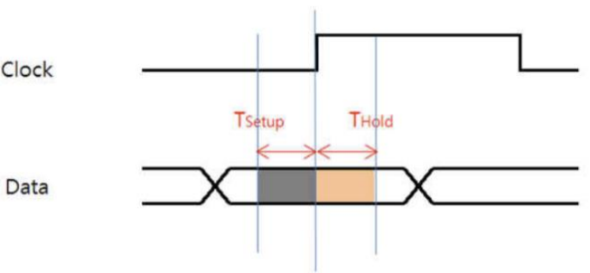
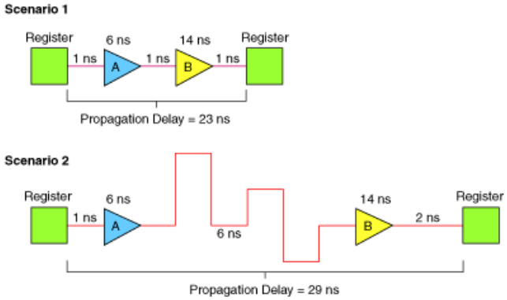

# Day 1

## Setup/Hold Time

### Switching이 일어난 후 상태의 변화가 정확히 인식되도록 필요한 최소 시간

## Critical Path (임계 경로)
- 입력에서 출력까지 모든 경로 중에서 propagation delay(지연 시간)이 가장 긴 경로
- Critical Path는 회로의 **최대 동작 주파수**를 결정

- 가장 큰 propagation delay를 갖는 path (Setup violation에 영향)
- Scenario2 가 Scenario 1보다 큰 딜레이를 가지고 있으므로 

### 왜 중요한가?
- Setup Time Violation은 